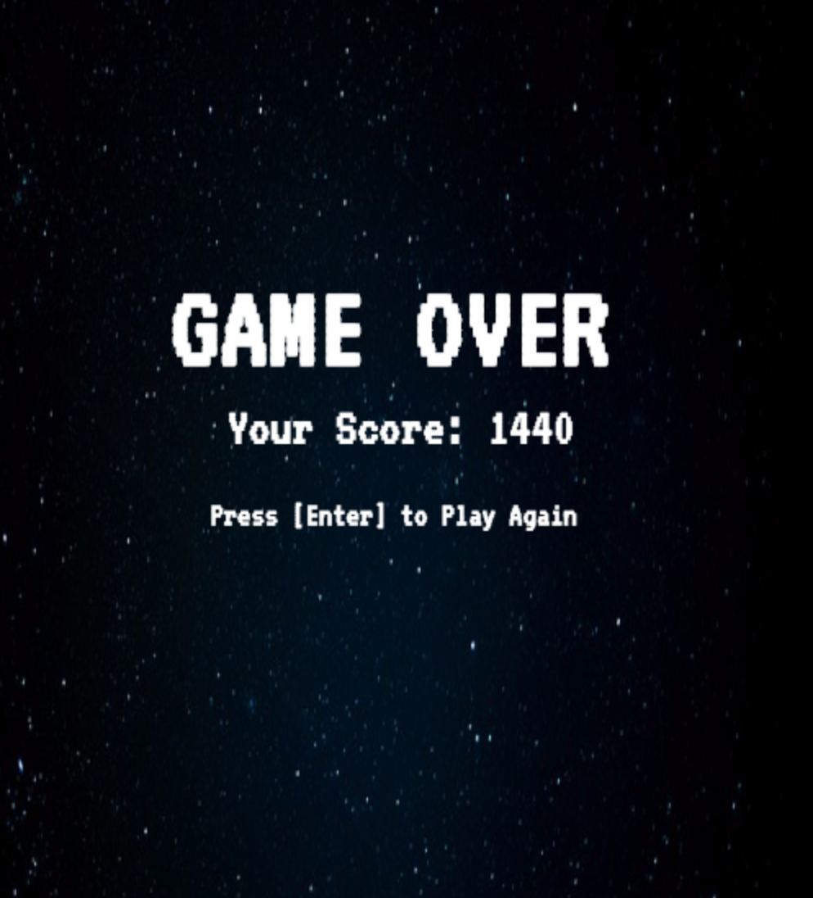

## Type-R

### Background

Type-R is a game centered around typing quickly and accurately. The player controls a ship (A "type-R" model) and must fend off alien ships by typing the words/letters that appear next to the given ship before it reaches the player.

### MVP

- [ ] Appropriate graphics and text appear near enemy ships
- [ ] Typing correct letters/word fires bullets from the player ship at the enemy ship with the corresponding letters/word
- [ ] Score keeping
- [ ] Game Over detection / replay prompt

### Screenshots and Gameplay

The player ship remains stationary towards the bottom of the screen as enemy alien ships descend from the top.  As the player types the correct letters appearing underneath an enemy ship, lasers fire at the ship with the corresponding letters until all letters are entered correctly and the enemy is destroyed.  If an alien ship reaches the player, it's game over.





### Technologies and Implementation Details

- Vanilla JavaScript for core game logic
- `HTML5 Canvas` for graphics
- `random-words` npm package for the word bank

In order to get the player ship to automatically face the alien target, some simple trigonometry is used:

```javascript
if (ship.hit(letter, this.target)) {
  this.target = ship;

  let x_len;
  if (Math.abs(ship.pos[0] - 250) <= 4) {
    x_len = 0;
  } else {
    x_len = ship.pos[0] > 250 ? (ship.pos[0] - 250) : -(250 - ship.pos[0]);
  }
  let y_len = 1100 - (ship.pos[1]);
  this.angle = Math.atan(x_len/y_len);
```

The PlayerShip object first sets the alien ship whose leading letter corresponds to the player input (if any such ship exists) as its target.  

Next, since the player ship remains in a fixed position in the middle and at the bottom of the canvas, the target ship's position is used to acquire the proper angle that the player ship should face while firing.

A right triangle can be formed from the player ship to the alien target, and the lengths of the opposite and adjacent sides of this triangle relative to the angle that the player ship should make are obtained by simple subtractions from the players fixed position.

Finally, the angle is obtained through the arctangent function, using the previously mentioned side lengths. 

### To-do

- [ ] Background music
- [ ] Improved animations
- [ ] Improved enemy AI and abilities
- [ ] Wave/round based gameplay
