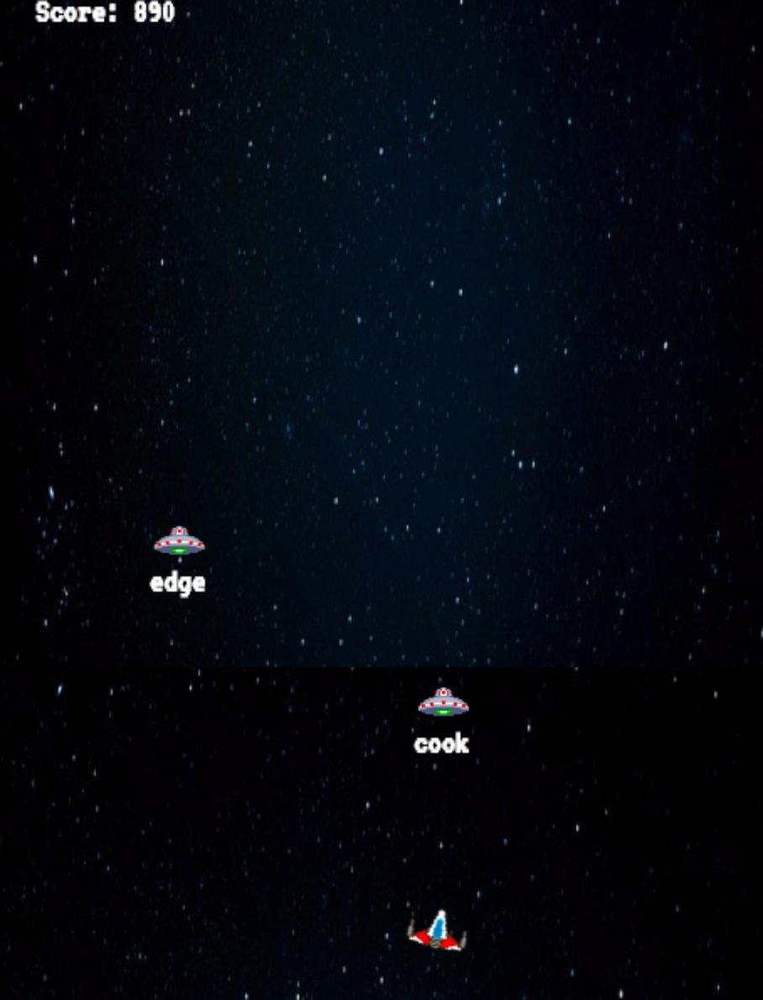

## Type-R

### Background

Type-R is a game centered around typing quickly and accurately. The player controls a ship (A type-R model) and must fend off enemy ships by typing the words/letters that appear next to the given ship before it reaches the player.

### MVP

- [ ] Appropriate graphics and text appear near enemy ships
- [ ] Typing correct letters/word fires bullets from the player ship at the enemy ship with the corresponding letters/word
- [ ] Score keeping
- [ ] Game Over detection / replay prompt

### Wireframes

The player ship will remain stationary towards the bottom of the screen as enemy ships descend from the top.  As the player types the correct letters appearing over an enemy ship, bullets will fire at the enemy ship with those letters until all letters are entered correctly and the ship is destroyed.  When too many enemy ships reach the player, the player ship will be destroyed and the user will be presented with a stats game over screen and prompted to play again.

### Technologies

- JavaScript and `jquery` for core game logic and key listening.
- `Easel.js` with `HTML5 Canvas` for graphics and DOM manipulation.

### Timeline

**Day 1**: Setup and installation of required dependencies. Become familiar with Canvas and Easel.js. Get the player ship rendered onscreen.

**Day 2**: Use jquery for key-listeners that will be able to detect the words that the player is typing and manipulate the DOM accordingly only when accurate letters are typed.

**Day 3**: Get enemies onscreen and scrolling towards the player. Display random letters/words over enemy ships that follow the ship.

**Day 4**: Finalize game logic and styling.

### Bonus features

- [ ] Music and sound effects
- [ ] Fancy explosions
- [ ] A small story/intro
